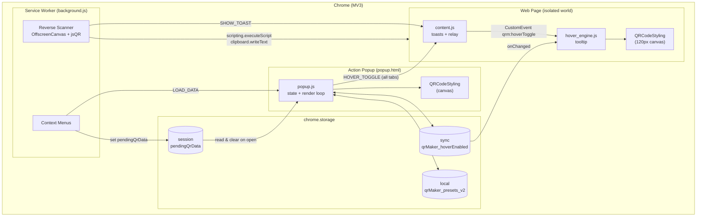
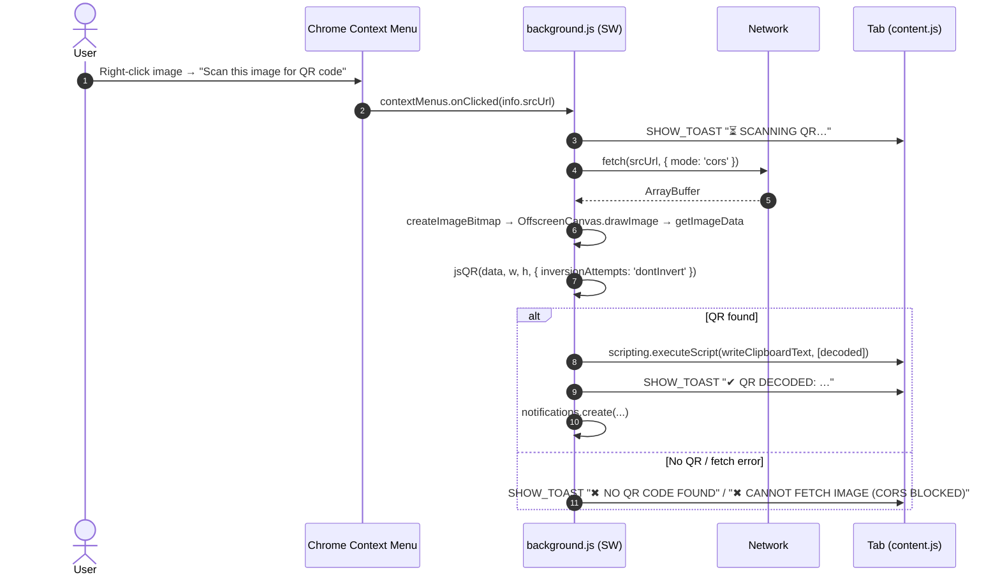
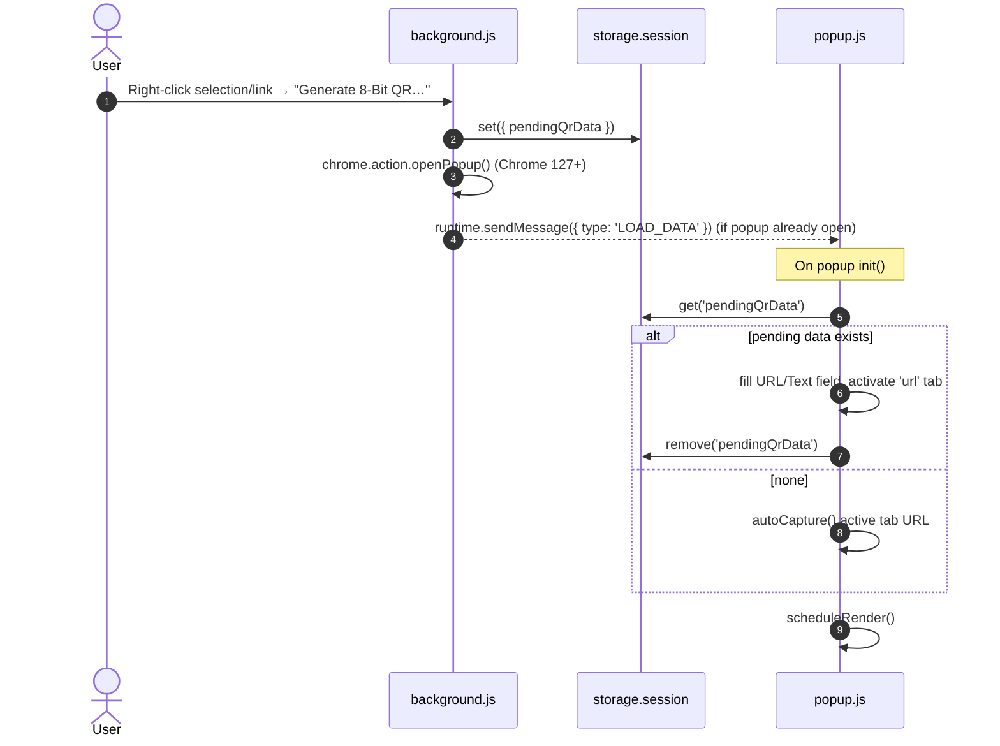
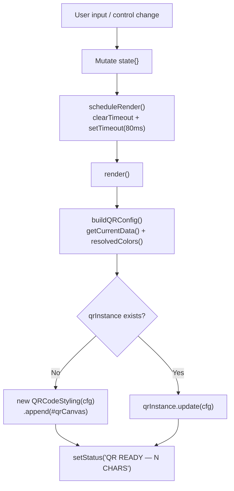

<div align="center">

# QR Code Creator

**A zero-build, privacy-first Chrome extension (Manifest V3) that generates, styles, previews, and reverse-scans QR codes in your browser, with a retro PICO-8 pixel-art UI.**

[](https://chromewebstore.google.com/search/OstinUA)
[](https://devs-in-exile.pages.dev/extensions)

[](LICENSE)
[](manifest.json)
[](https://developer.chrome.com/docs/extensions/develop/migrate/what-is-mv3)
[](#prerequisites)
[](#tech-stack--architecture)
[](#installation)
[](#testing)

</div>

> [!NOTE]
> Everything in this document comes from the source code (`manifest.json`, `background.js`, `content.js`, `hover_engine.js`, `popup.*`). If the code changes, update this file to match.

---

## Table of Contents

1. [Features](#features)
2. [Tech Stack & Architecture](#tech-stack--architecture)
   - [Core Technologies](#core-technologies)
   - [Project Structure](#project-structure)
   - [Key Design Decisions](#key-design-decisions)
3. [Getting Started](#getting-started)
   - [Prerequisites](#prerequisites)
   - [Installation](#installation)
4. [Testing](#testing)
5. [Deployment](#deployment)
6. [Usage](#usage)
   - [End-User Workflows](#end-user-workflows)
   - [Developer Usage: Internal APIs & Messaging](#developer-usage-internal-apis--messaging)
   - [Edge Cases & Known Issues](#edge-cases--known-issues)
7. [Configuration](#configuration)
   - [Manifest](#manifest-manifestjson)
   - [Permissions Reference](#permissions-reference)
   - [Behavioral Constants](#behavioral-constants)
   - [Persisted State](#persisted-state-chromestorage)
8. [License](#license)
9. [Contacts & Community Support](#support-the-project)

---

## Features

### QR Generation (Popup)
- **Auto-capture of the active tab:** when the popup opens, it reads the current tab's URL with `chrome.tabs.query` and renders a QR code right away. Internal `chrome://` and `chrome-extension://` pages are skipped.
- **Three payload types**, each in its own tab:
  - **URL / Text:** any string. An empty field falls back to `https://example.com`.
  - **Wi-Fi:** SSID, password, encryption (`WPA`/`WPA2`, `WEP`, `nopass`), and a hidden-network flag. Output uses the standard `WIFI:T:…;S:…;P:…;H:…;;` URI format, and reserved characters (`\ ; , " :`) are escaped.
  - **vCard 3.0:** first/last name, phone (`TEL;TYPE=CELL`), email, organization, and website.
- **Debounced live preview:** re-renders 80 ms after the last change, so typing stays responsive.
- **In-place re-rendering:** one `QRCodeStyling` instance is created and then updated with `.update()`, so the DOM isn't rebuilt on every keystroke.

### Styling Engine (Advanced Settings accordion)
- **Error correction level:** `L` (7%), `M` (15%), `Q` (25%), `H` (30%) recovery.
- **Dot styles:** `square`, `dots`, `rounded`, `classy`, `classy-rounded`, `extra-rounded`.
- **Corner square styles:** `square`, `extra-rounded`, `dot`.
- **Corner dot styles:** `square`, `dot`.
- **Three independent color channels:** dots, background, corners (native `<input type="color">` pickers).
- **Six PICO-8 quick palettes:** *Midnight*, *Matrix*, *Retro Red*, *Neon Blue*, *Arcade Gold*, *Pixel Pink*.
- **Invert toggle:** swaps the foreground and background colors without touching your saved color picks.
- **Center logo embedding:** upload any `image/*` file. It's stored as a Base64 data URL, placed at 30% of the QR size with a 4 px margin, and the dots behind it are removed (`hideBackgroundDots`).

### Export & Clipboard
- **PNG download:** canvas-based, pixel-sharp output (`qr-code-8bit.png`).
- **SVG download:** a separate SVG-type instance is built for clean vector output for print (`qr-code-8bit.svg`).
- **Copy image to clipboard:** `getRawData('png')` → `ClipboardItem({ 'image/png': blob })`.
- **Copy raw data string:** copies the encoded payload (URL, `WIFI:` string, or vCard text).

### Design Presets
- **Save the current design** with a custom name (up to 20 characters, uppercased).
- **52 × 52 thumbnails** rendered with nearest-neighbor scaling (`imageSmoothingEnabled = false`) so the pixel art stays crisp.
- **One-click restore** and **hover-to-delete** on each preset card.
- Saved in `chrome.storage.local`, so presets survive browser restarts.

### Page Integrations (Context Menus & Content Scripts)
- **Right-click selected text** → *"Generate 8-Bit QR for: …"*
- **Right-click a link** → *"Generate 8-Bit QR for this link"*
- **Right-click an image** → *"Scan this image for QR code"* (the **reverse scanner**). It decodes the image with `jsQR` inside the service worker, copies the result to the clipboard, and shows an on-page toast plus a system notification.
- **Hover Preview Engine (opt-in):** hover any `http(s)` link to see a floating 120 × 120 px QR tooltip after 350 ms. The tooltip stays inside the viewport and is labeled with the target hostname.
- **Pixel-art toasts** on any web page, styled inline so the host page's CSS can't interfere.

### UX & Accessibility
- **Retro aesthetic:** PICO-8 16-color palette, the *Press Start 2P* font, hard pixel borders, and stepped (non-eased) transitions.
- **Automatic light/dark theme** via `prefers-color-scheme`, with semantic CSS custom properties and contrast tuned for legibility (about 4.5:1 for accent text in light mode).
- **ARIA throughout:** `role="tablist"`/`tab`/`tabpanel`, `aria-selected`, `aria-expanded`, `aria-live="polite"` toasts, and `hidden` on inactive panels.
- **8-bit particle bursts** on successful actions.

### Privacy & Footprint
- **No backend, telemetry, analytics, or account.** All generation and decoding happens on your machine.
- **No build toolchain:** plain HTML/CSS/JS plus two vendored libraries. What you read in the repo is what runs.

---

## Tech Stack & Architecture

### Core Technologies

| Layer | Technology | Notes |
|---|---|---|
| Platform | **Chrome Extensions, Manifest V3** | Service worker background, content scripts, action popup |
| Language | **Vanilla JavaScript (ES2020+)** | `'use strict'`, optional chaining, nullish coalescing, `async/await` |
| Markup / Styles | **HTML5 + CSS3** | CSS custom properties, `prefers-color-scheme`, `image-rendering: pixelated` |
| QR rendering | [`qr-code-styling`](https://github.com/kozakdenys/qr-code-styling) (vendored, minified UMD) | Global `QRCodeStyling` constructor. Used in the popup and the hover engine |
| QR decoding | [`jsQR`](https://github.com/cozmo/jsQR) (vendored UMD) | Global `jsQR(data, width, height, options)`. Loaded with `importScripts()` in the service worker |
| Typography | [Press Start 2P](https://fonts.google.com/specimen/Press+Start+2P) (Google Fonts CDN) | Falls back to `monospace` when offline |
| Chrome APIs | `action`, `contextMenus`, `storage` (`local` / `sync` / `session`), `tabs`, `scripting`, `notifications`, `runtime` messaging | See [Permissions](#permissions-reference) |
| Graphics | `OffscreenCanvas`, `createImageBitmap`, `<canvas>`, SVG | Worker-safe image decoding for the reverse scanner |

> [!IMPORTANT]
> There is **no `package.json`, bundler, transpiler, or npm dependency tree**. The two third-party libraries are committed to `libs/` and loaded as globals. This is deliberate: MV3 forbids remotely hosted code, and vendoring keeps the extension reproducible and reviewable.

### Project Structure

```text
QR-Code-Creator/
├── manifest.json            # MV3 manifest: permissions, service worker, content scripts
├── background.js            # Service worker: context menus, reverse scanner, messaging hub
├── content.js               # Content script: on-page pixel toasts, HOVER_TOGGLE relay
├── hover_engine.js          # Content script: floating QR tooltip on link hover
├── popup.html               # Popup markup: tabs, panels, QR frame, accordion, presets
├── popup.css                # PICO-8 design system, light/dark tokens, animations
├── popup.js                 # Popup controller: state, render loop, exports, presets
├── icons/
│   └── icon128.png          # Toolbar / store icon
├── libs/
│   ├── qr-code-styling.min.js   # QR renderer (UMD → window.QRCodeStyling)
│   └── jsqr.js                  # QR decoder  (UMD → self.jsQR)
└── LICENSE                  # Apache License 2.0
```

<details>
<summary><strong>File-by-file responsibilities and runtime context</strong></summary>

| File | Execution context | Loaded by | Key responsibilities |
|---|---|---|---|
| `manifest.json` | n/a | Chrome | Declares the MV3 service worker (`background.js`), content scripts on `*://*/*` at `document_idle` (top frame only), popup, icons, and `web_accessible_resources`. |
| `background.js` | **Classic (non-module) service worker** | `background.service_worker` | Creates 3 context menus on `runtime.onInstalled`; handles clicks; runs the reverse scanner (`fetch` → `createImageBitmap` → `OffscreenCanvas` → `jsQR`); injects a clipboard writer with `scripting.executeScript`; sends `SHOW_TOAST` to tabs; answers `GET_PENDING_DATA`. |
| `content.js` | Isolated world of every top-level `http(s)` page | `content_scripts[0].js[1]` | Singleton toast element (max `z-index`, inline styles); routes `SHOW_TOAST`; re-dispatches `HOVER_TOGGLE` as the DOM `CustomEvent` `qrm:hoverToggle`. |
| `hover_engine.js` | Same isolated world as `content.js` | `content_scripts[0].js[2]` | Reads `qrMaker_hoverEnabled` from `storage.sync`; delegates `mouseover`/`mouseout` on `document` (capture phase); renders one reused `QRCodeStyling` instance in a pixel-bordered tooltip; listens to `qrm:hoverToggle` and `storage.onChanged`. |
| `popup.html` | Extension page (`chrome-extension://…/popup.html`) | `action.default_popup` | UI skeleton. Loads `libs/qr-code-styling.min.js` **before** `popup.js` (load order matters). |
| `popup.js` | Extension page | `<script>` in `popup.html` | Central `state` object (single source of truth), payload builders, debounced render, PNG/SVG/clipboard export, presets CRUD, hover toggle broadcast, pending-data intake. |
| `popup.css` | Extension page | `<link>` in `popup.html` | PICO-8 palette constants, semantic theme tokens, light-mode overrides, component styles, particle and toast animations. |
| `libs/qr-code-styling.min.js` | Popup + content scripts | `<script>` / `content_scripts` | Renders styled QR codes to `<canvas>` or SVG; `.append()`, `.update()`, `.download()`, `.getRawData()`. |
| `libs/jsqr.js` | Service worker | `importScripts('libs/jsqr.js')` | Decodes QR codes from RGBA pixel buffers. |

</details>

### Key Design Decisions

1. **Zero-build, vendored dependencies.** MV3 bans remote code, and the extension is small enough that a bundler would cost more than it saves. Libraries are loaded as UMD globals.
2. **Classic service worker instead of an ES module.** `importScripts()` only works in classic workers, and that's the simplest way to load the `jsQR` UMD bundle into the background context.
3. **Decoding in the worker with `OffscreenCanvas`.** The reverse scanner doesn't need a DOM, an offscreen document, or a hidden tab. Because the extension has host permissions, the service worker can fetch most cross-origin images directly.
4. **One source of truth in the popup.** Every control writes to the `state` object and calls `scheduleRender()`. `buildQRConfig()` is a pure projection of `state` into a `qr-code-styling` options object, and presets are snapshots of `state`.
5. **Reused renderer instances.** Both the popup and the hover engine create a single `QRCodeStyling` instance and call `.update(cfg)` on it, which avoids creating and tearing down canvases repeatedly.
6. **Matching storage area to data lifetime:**
   - `storage.session`: short-lived context-menu handoff (`pendingQrData`), cleared once read.
   - `storage.sync`: the hover-preview preference (follows the user across devices).
   - `storage.local`: presets, which can be large because of logo data URLs and thumbnails.
7. **Event delegation for hover.** One set of capture-phase listeners on `document` covers links added later by SPAs, with no `MutationObserver` needed.
8. **Inline styles for injected UI.** Toasts and tooltips use `Object.assign(el.style, …)` and maximum `z-index` values, so host-page CSS can't override them and no stylesheet has to be injected.
9. **Popup → hover engine relay through a DOM event.** `content.js` owns the single `runtime.onMessage` listener and forwards hover toggles as `CustomEvent('qrm:hoverToggle')`. `hover_engine.js` also watches `storage.onChanged` as a backup path.

<details>
<summary><strong>Diagram: component topology</strong></summary>



</details>

<details>
<summary><strong>Diagram: reverse scanner pipeline (right-click an image)</strong></summary>



</details>

<details>
<summary><strong>Diagram: context-menu → popup handoff (selection / link)</strong></summary>



</details>

<details>
<summary><strong>Diagram: popup render loop</strong></summary>



</details>

---

## Getting Started

### Prerequisites

| Requirement | Version | Why |
|---|---|---|
| **Google Chrome** or another Chromium browser (Edge, Brave, Opera, Vivaldi) | **102+** minimum; **127+** recommended | `chrome.storage.session` needs Chrome 102+. Opening the popup programmatically from a context menu (`chrome.action.openPopup`) needs Chrome 127+. |
| **Git** | any recent | To clone the repository |
| **Node.js** *(optional)* | 18+ | Only for the optional syntax checks and linting in [Testing](#testing) |
| **zip** *(optional)* | any | To package a `.zip` for the Chrome Web Store |

> [!NOTE]
> You don't need Python, Docker, npm packages, or a build tool to run this extension.

### Installation

**1. Clone the repository**

```bash
git clone https://github.com/Chrome-Extensions-labs/QR-Code-Creator.git
cd QR-Code-Creator
```

**2. Load it as an unpacked extension**

1. Open `chrome://extensions` (Edge: `edge://extensions`, Brave: `brave://extensions`).
2. Turn on **Developer mode** (toggle in the top-right).
3. Click **Load unpacked** and select the cloned `QR-Code-Creator/` folder (the one that contains `manifest.json`).
4. Optionally, pin **QR Code Creator** from the puzzle-piece (Extensions) menu.

**3. Refresh tabs that were already open**

Content scripts are only injected into pages loaded **after** the extension is installed or reloaded.

> [!TIP]
> After editing the source, click the **↻ Reload** button on the extension card in `chrome://extensions`, then reload the web pages you're testing. Changes to the popup take effect the next time you open it. Changes to `background.js` and content scripts need the extension reload.

<details>
<summary><strong>Troubleshooting and alternative installation methods</strong></summary>

#### Common problems

| Symptom | Likely cause | Fix |
|---|---|---|
| "Manifest file is missing or unreadable" | Wrong folder selected | Select the directory that **directly** contains `manifest.json`. |
| Context-menu items missing | Menus are created in `runtime.onInstalled` | Reload the extension from `chrome://extensions`. |
| No toast or hover tooltip on a page | Page was open before install, or it's a restricted page (`chrome://`, Chrome Web Store, PDF viewer, `file://`) | Refresh the tab. Content scripts never run on restricted pages. |
| "CANNOT FETCH IMAGE (CORS BLOCKED)" | Image needs cookies or auth, is a `blob:` URL, or the server rejected the request | Save the image and open it in its own tab, or screenshot the QR code and right-click the screenshot opened from an `http(s)` URL. |
| "NO QR CODE FOUND IN IMAGE" | QR code is inverted (light on dark), too small, blurry, or cropped | See [Edge Cases & Known Issues](#edge-cases--known-issues). |
| Popup font looks like a generic monospace font | No internet access (font comes from Google Fonts) | Expected fallback. To bundle the font locally, see [Configuration](#configuration). |
| "COPY FAILED — CHECK PERMISSIONS" | Clipboard image write was blocked | Make sure the popup has focus. Some Chromium forks restrict `ClipboardItem`. |
| Service worker shows "Inactive" | Normal MV3 behavior: the worker sleeps when idle | It wakes up automatically on events. Click "service worker" on the extension card to inspect it. |

#### Inspecting each context

- **Popup:** right-click inside the popup → **Inspect**.
- **Service worker:** `chrome://extensions` → extension card → **Inspect views: service worker**. Log prefix: `[BG]`.
- **Content scripts:** DevTools on any page → **Console**, then switch the context dropdown to *QR Code Creator*. Log prefixes: `[QR Maker]`, `[HoverEngine]`.

#### Installing from a packaged `.zip` / `.crx`

1. Build a package as described in [Deployment](#deployment).
2. **Unpacked:** unzip it and use **Load unpacked** on the extracted folder.
3. **CRX:** on `chrome://extensions`, click **Pack extension**, select the folder (optionally with an existing `.pem` key), and distribute the resulting `.crx` through enterprise policy. Chrome blocks manually installed off-store CRX files on Windows and macOS unless policy allows them.

#### Updating the vendored libraries (building from upstream source)

The `libs/` folder holds prebuilt UMD bundles. To refresh them:

```bash
# Inspect the current upstream builds (requires Node.js)
npm view qr-code-styling version
npm view jsqr version

# Fetch the distributable bundles into a temporary directory
mkdir -p /tmp/qrlibs && cd /tmp/qrlibs
npm pack qr-code-styling jsqr
tar -xzf qr-code-styling-*.tgz && cp package/lib/qr-code-styling.js ./qr-code-styling.min.js && rm -rf package
tar -xzf jsqr-*.tgz          && cp package/dist/jsQR.js            ./jsqr.js               && rm -rf package

# Review, then copy into the extension
cp qr-code-styling.min.js jsqr.js /path/to/QR-Code-Creator/libs/
```

> [!WARNING]
> Paths inside upstream tarballs can change between releases, so check them before copying. After any library upgrade, repeat the full manual QA checklist in [Testing](#testing), especially the `.update()`, `.download()`, and `.getRawData()` behavior of `qr-code-styling`.

</details>

---

## Testing

> [!IMPORTANT]
> The repository **doesn't include an automated test suite, test runner, or CI workflow yet.** Right now quality is checked with static checks plus a structured manual QA pass. The commands below were verified against the current codebase.

### 1. Static checks (no install required beyond Node.js)

```bash
# Syntax-check every first-party script (exits non-zero on the first parse error)
for f in background.js content.js hover_engine.js popup.js; do node --check "$f" || exit 1; done && echo "syntax OK"

# Validate manifest.json is well-formed JSON and targets Manifest V3
node -e "const m=require('./manifest.json'); if(m.manifest_version!==3) process.exit(1); console.log('manifest OK v'+m.version)"
```

### 2. Linting (ESLint, zero-config parse check)

```bash
# Parses all first-party sources with modern ECMAScript defaults; no config file needed
npx --yes eslint@latest --no-config-lookup background.js content.js hover_engine.js popup.js
```

<details>
<summary><strong>Optional: a stricter ESLint flat config for extension globals</strong></summary>

Create `eslint.config.mjs` (not committed today) to turn on real rules and declare the extension's globals:

```js
// eslint.config.mjs
import js from '@eslint/js';
import globals from 'globals';

export default [
  { ignores: ['libs/**'] },               // never lint vendored bundles
  js.configs.recommended,
  {
    files: ['**/*.js'],
    languageOptions: {
      ecmaVersion: 2022,
      sourceType: 'script',               // classic scripts, not ES modules
      globals: {
        ...globals.browser,
        ...globals.serviceworker,
        ...globals.webextensions,         // provides `chrome`
        QRCodeStyling: 'readonly',        // from libs/qr-code-styling.min.js
        jsQR: 'readonly',                 // from libs/jsqr.js
      },
    },
    rules: {
      'no-unused-vars': ['warn', { argsIgnorePattern: '^_' }],
    },
  },
];
```

```bash
npm i -D eslint @eslint/js globals
npx eslint .
```

</details>

### 3. Manual QA checklist (functional and integration)

Run these after loading the unpacked extension. Together they exercise every component and message path.

<details>
<summary><strong>Full manual regression checklist (≈ 30 checks)</strong></summary>

**Popup: generation**
- [ ] Opening the popup on an `https://` page fills in the tab URL and renders a QR code. The status bar reads `CAPTURED: …` and then `QR READY — N CHARS`.
- [ ] Opening the popup on `chrome://extensions` leaves the field empty and the status reads `ENTER URL OR TEXT ABOVE`.
- [ ] Typing in **URL/TEXT** updates the preview live, with no flicker.
- [ ] **Wi-Fi:** fill in SSID and password, choose WPA, scan with a phone, and confirm it offers to join the network. Repeat with **HIDDEN NETWORK** checked and with `NONE (OPEN)`.
- [ ] **Wi-Fi escaping:** an SSID like `My;Net:"Home"` still joins correctly.
- [ ] **vCard:** fill in all fields, scan, and confirm the phone offers to add the contact with every field present.
- [ ] Leaving first and last name empty on the vCard tab produces a placeholder (blank) QR code and doesn't crash.

**Popup: styling**
- [ ] Each ECL button (L/M/Q/H) visibly changes module density.
- [ ] All 6 dot styles, 3 corner-square styles, and 2 corner-dot styles render.
- [ ] The three color pickers and all six quick palettes apply.
- [ ] **INVERT** swaps the foreground and background, and the QR code still scans.
- [ ] Uploading a PNG/JPG/SVG logo centers it with background dots removed and it still scans at ECL `H`. **REMOVE** clears it.

**Popup: export**
- [ ] **PNG** downloads `qr-code-8bit.png` and shows the particle burst and toast.
- [ ] **SVG** downloads `qr-code-8bit.svg`, which opens in a browser or vector editor.
- [ ] **COPY IMG** lets you paste the image into an image-capable app (Docs, Slack, Paint).
- [ ] **COPY DATA** pastes the exact payload string.

**Popup: presets**
- [ ] Save a preset, close the popup, reopen it, and confirm the preset is still there with a thumbnail.
- [ ] Clicking a preset restores every style control (buttons highlighted, swatches, invert, logo).
- [ ] Hovering a preset and clicking ✕ deletes it, and the `[ NO PRESETS YET ]` placeholder comes back once the last one is gone.

**Context menus and service worker**
- [ ] Select text → right-click → *Generate 8-Bit QR for: "…"* opens the popup with that text (Chrome 127+). On older versions, clicking the toolbar icon shows the text.
- [ ] Right-click a link → *Generate 8-Bit QR for this link* puts the link URL in the popup.
- [ ] Right-click an image that contains a QR code → *Scan this image…* shows `⏳ SCANNING QR…` and then `✔ QR DECODED: …`, and the decoded text is on the clipboard.
- [ ] Right-click an image without a QR code → `✖ NO QR CODE FOUND IN IMAGE`.

**Hover engine**
- [ ] Turn on **FLOATING QR ON HOVER**. Hovering a link for about 350 ms shows the tooltip with the hostname label.
- [ ] Near the right or bottom edge of the viewport, the tooltip flips to stay on screen.
- [ ] `mailto:`, `tel:`, and `javascript:` links don't show a tooltip.
- [ ] Turning the toggle off hides tooltips right away in every open tab, without a reload.
- [ ] Links added dynamically (for example, infinite-scroll feeds) also get tooltips.

**Theming and accessibility**
- [ ] Switching the OS between light and dark mode switches the popup palette.
- [ ] You can reach the tabs, buttons, and the accordion with the keyboard.

</details>

### 4. Toward automated testing (recommended roadmap)

<details>
<summary><strong>Suggested approach for unit and end-to-end tests</strong></summary>

- **Unit tests (Vitest/Jest + jsdom):** pull the pure functions in `popup.js` (`buildWifiString`, `buildVCardString`, `resolvedColors`, `buildQRConfig`) into a small module that takes plain arguments instead of reading the DOM, then cover escaping, empty-field fallbacks, and invert logic.
- **Chrome API mocking:** use [`jest-chrome`](https://github.com/extend-chrome/jest-chrome) or [`sinon-chrome`](https://github.com/acvetkov/sinon-chrome) to assert the `storage.session` handoff and the `tabs.sendMessage` payloads.
- **End-to-end (Puppeteer or Playwright):** launch Chromium with `--disable-extensions-except=<path> --load-extension=<path>`, open `chrome-extension://<id>/popup.html` directly, and check the rendered `<canvas>` by decoding it with `jsQR` in the test itself (a full round trip).

```bash
# Example E2E bootstrap (Playwright, persistent context required for extensions)
npm i -D @playwright/test && npx playwright install chromium
```

</details>

---

## Deployment

"Deploying" this project means **packaging the extension and publishing it** to the Chrome Web Store (or distributing it through enterprise policy). There's no server, so containerization (Docker, Docker Compose) **doesn't apply**.

### 1. Pre-release checklist

1. Bump `"version"` in `manifest.json` following SemVer (`MAJOR.MINOR.PATCH`). The Chrome Web Store rejects re-uploads with the same version.
2. Run every command in [Testing](#testing) and the manual QA checklist.
3. Replace the placeholder links in `popup.html` (the header points to `https://www.google.com/` and the status-bar stars to `https://example.com`) with the real repository or store URLs.
4. Add the store icon sizes Chrome recommends (`16`, `32`, `48`, `128`). `background.js` already refers to `icons/icon48.png` for notifications (see [Edge Cases & Known Issues](#edge-cases--known-issues)).

### 2. Build the distributable archive

Only runtime files go into the archive. Repository metadata stays out.

```bash
# From the repository root
VERSION=$(node -p "require('./manifest.json').version")
mkdir -p dist
zip -r "dist/qr-code-creator-v${VERSION}.zip" \
  manifest.json background.js content.js hover_engine.js \
  popup.html popup.css popup.js icons libs LICENSE \
  -x "*.DS_Store"
unzip -l "dist/qr-code-creator-v${VERSION}.zip"
```

> [!NOTE]
> Add `dist/` to `.gitignore`. Build artifacts don't belong in version control. Publish them as GitHub Release assets instead.

### 3. Publish to the Chrome Web Store

1. Register on the [Chrome Web Store Developer Dashboard](https://chrome.google.com/webstore/devconsole) (one-time fee).
2. **New item** → upload the `.zip`.
3. Fill in the listing (description, screenshots at 1280×800 or 640×400, 128×128 icon), the privacy-practices disclosures, and a **justification for every permission** (see the [Permissions Reference](#permissions-reference)).
4. Submit for review.

> [!CAUTION]
> The broad `host_permissions: ["*://*/*"]` plus content scripts on every page typically trigger **in-depth review** and can slow approval. Be ready to explain that they're needed for the hover preview, on-page toasts, and cross-origin image fetching for the reverse scanner. If you want to cut review friction, consider switching to `activeTab` plus `optional_host_permissions` requested at runtime.

### 4. CI/CD integration (template)

There's no workflow in the repo today. The GitHub Actions example below validates, lints, and packages on every push, and attaches the zip to tagged releases.

<details>
<summary><strong><code>.github/workflows/release.yml</code> (example)</strong></summary>

```yaml
name: Validate & Package Extension

on:
  push:
    branches: [main]
    tags: ['v*.*.*']
  pull_request:

permissions:
  contents: write   # needed to upload release assets on tags

jobs:
  build:
    runs-on: ubuntu-latest
    steps:
      - uses: actions/checkout@v4

      - uses: actions/setup-node@v4
        with:
          node-version: 22

      - name: Syntax check
        run: for f in background.js content.js hover_engine.js popup.js; do node --check "$f"; done

      - name: Validate manifest
        run: node -e "const m=require('./manifest.json'); if(m.manifest_version!==3) process.exit(1)"

      - name: Verify tag matches manifest version
        if: startsWith(github.ref, 'refs/tags/v')
        run: |
          V=$(node -p "require('./manifest.json').version")
          [ "v$V" = "${GITHUB_REF_NAME}" ] || { echo "Tag ${GITHUB_REF_NAME} != manifest v$V"; exit 1; }

      - name: Lint
        run: npx --yes eslint@latest --no-config-lookup background.js content.js hover_engine.js popup.js

      - name: Package
        run: |
          V=$(node -p "require('./manifest.json').version")
          mkdir -p dist
          zip -r "dist/qr-code-creator-v$V.zip" manifest.json background.js content.js \
            hover_engine.js popup.html popup.css popup.js icons libs LICENSE

      - uses: actions/upload-artifact@v4
        with:
          name: extension-zip
          path: dist/*.zip

      - name: Attach to GitHub Release
        if: startsWith(github.ref, 'refs/tags/v')
        env:
          GH_TOKEN: ${{ github.token }}
        run: gh release create "${GITHUB_REF_NAME}" dist/*.zip --generate-notes
```

To automate store uploads as well, add a step that uses the [Chrome Web Store API](https://developer.chrome.com/docs/webstore/using-api) (for example with [`chrome-webstore-upload-cli`](https://github.com/fregante/chrome-webstore-upload-cli)). Keep `CLIENT_ID`, `CLIENT_SECRET`, `REFRESH_TOKEN`, and `EXTENSION_ID` in **GitHub Actions secrets**, never in the repository.

</details>

### 5. Enterprise / managed distribution

<details>
<summary><strong>Force-installing through Chrome policy</strong></summary>

- **Store-hosted:** add `<extension-id>;https://clients2.google.com/service/update2/crx` to the `ExtensionInstallForcelist` policy (Google Admin console, GPO, or a macOS configuration profile).
- **Self-hosted:** host the `.crx` and an `update.xml` manifest on HTTPS, then point `ExtensionInstallForcelist` at your `update.xml` URL. Keep the `.pem` signing key that **Pack extension** generates, because losing it changes the extension ID.

</details>

---

## Usage

### End-User Workflows

| Goal | How |
|---|---|
| QR code for the current page | Click the toolbar icon. The URL is captured automatically. |
| QR code for any text | Open the popup → **URL/TEXT** tab → type or paste. |
| Share Wi-Fi credentials | **WI-FI** tab → SSID, password, encryption → **PNG** or **COPY IMG**. |
| Share a contact card | **VCARD** tab → fill in the fields → export. |
| QR code for highlighted text | Select text on a page → right-click → *Generate 8-Bit QR for: "…"*. |
| QR code for a link without opening it | Right-click the link → *Generate 8-Bit QR for this link*. |
| Read a QR code embedded in a page | Right-click the image → *Scan this image for QR code*. The result is copied to the clipboard. |
| Preview a link's QR code on hover | Popup → **ADVANCED SETTINGS** → **FLOATING QR ON HOVER: ON**. |
| Reuse a branded style | Style the code → **SAVE CURRENT DESIGN** → click the preset later. |

> [!TIP]
> If you embed a logo, set error correction to **`H`**. The logo covers part of the symbol, and `H` can recover about 30% of the data, so the code stays scannable.

> [!WARNING]
> Wi-Fi QR codes store the network password **in plain text** inside the image. Anyone who scans or photographs it can read the password, so share these images with care.

### Developer Usage: Internal APIs & Messaging

The extension's "API" is its internal message protocol plus the `qr-code-styling` and `jsQR` calls. The examples below match the code and work in the DevTools console of the matching context.

**Rendering a QR code with `QRCodeStyling` (how `popup.js` does it)**

```js
// popup.js: create the renderer once, then mutate it in place.
const cfg = {
  width: 200, height: 200,
  type: 'canvas',                       // canvas keeps modules pixel-sharp
  data: 'https://example.com' || ' ',   // never pass '' (the library throws on empty data)
  dotsOptions:          { type: 'square', color: '#000000' },
  cornersSquareOptions: { type: 'square', color: '#000000' },
  cornersDotOptions:    { type: 'square', color: '#000000' },
  backgroundOptions:    { color: '#ffffff' },
  qrOptions:            { errorCorrectionLevel: 'M' },
};

let qr = new QRCodeStyling(cfg);              // first render: build the instance
qr.append(document.getElementById('qrCanvas'));

qr.update({ ...cfg, data: 'Hello, 8-bit!' }); // later renders: update in place (no DOM churn)

await qr.download({ name: 'qr-code-8bit', extension: 'png' }); // triggers a file download
const blob = await qr.getRawData('png');                        // Blob for clipboard or thumbnails
```

**Showing an on-page toast from the service worker**

```js
// Run in the service-worker DevTools console (chrome://extensions → "service worker")
const [tab] = await chrome.tabs.query({ active: true, lastFocusedWindow: true });
await chrome.tabs.sendMessage(tab.id, {
  type: 'SHOW_TOAST',      // handled by content.js
  message: '✔ HELLO FROM BG',
  isError: false,          // true = red error theme
  duration: 2500,          // ms before auto-hide
});
```

**Turning the hover engine on or off programmatically**

```js
// Run in the popup DevTools console. Writing to sync storage is enough:
// hover_engine.js listens to chrome.storage.onChanged in every tab.
await chrome.storage.sync.set({ qrMaker_hoverEnabled: true });
```

**Payload formats produced by the builders**

```text
# Wi-Fi (buildWifiString), with reserved characters  \ ; , " :  escaped by a backslash
WIFI:T:WPA;S:PixelNet_5G;P:s3cr\;et;H:false;;

# vCard 3.0 (buildVCardString), lines joined with \n
BEGIN:VCARD
VERSION:3.0
N:Bros;Mario;;;
FN:Mario Bros
ORG:Mushroom Kingdom Inc.
TEL;TYPE=CELL:+1 555 000 0000
EMAIL:mario@mushroom.kingdom
URL:https://mushroom.kingdom
END:VCARD
```

<details>
<summary><strong>Message protocol reference</strong></summary>

| `type` | Direction | Transport | Payload | Response |
|---|---|---|---|---|
| `SHOW_TOAST` | `background.js` → `content.js` | `chrome.tabs.sendMessage` | `{ message: string, isError?: boolean, duration?: number }` | `{ ok: true }` |
| `HOVER_TOGGLE` | `popup.js` → `content.js` (every tab) | `chrome.tabs.sendMessage` | `{ enabled: boolean }` | `{ ok: true }` |
| `qrm:hoverToggle` | `content.js` → `hover_engine.js` | DOM `CustomEvent` on `document` | `detail: { enabled: boolean }` | n/a |
| `LOAD_DATA` | `background.js` → `popup.js` | `chrome.runtime.sendMessage` | `{ data: string }` | `{ ok: true }` |
| `GET_PENDING_DATA` | any → `background.js` | `chrome.runtime.sendMessage` | none | `{ data: string \| null }` (clears the value) |
| *(unknown)* | any → `content.js` | `chrome.tabs.sendMessage` | none | `{ ok: false, error: 'UNKNOWN MESSAGE TYPE' }` |

</details>

<details>
<summary><strong>Advanced usage: adding a new payload type (example: SMS)</strong></summary>

1. **Markup (`popup.html`):** add a tab button and a panel next to the existing ones.

```html
<button class="px-tab" id="tab-sms" role="tab" aria-selected="false"
        aria-controls="panel-sms" data-type="sms">
  <span class="tab-label">SMS</span>
</button>

<div class="input-panel" id="panel-sms" role="tabpanel" aria-labelledby="tab-sms" hidden>
  <label class="px-label" for="smsNumber">► NUMBER</label>
  <input class="px-input" id="smsNumber" type="tel" placeholder="+1 555 000 0000" />
  <label class="px-label" for="smsBody">► MESSAGE</label>
  <textarea class="px-input px-textarea" id="smsBody" rows="2"></textarea>
</div>
```

2. **Builder and routing (`popup.js`):**

```js
// Add DOM refs to the `dom` object
dom.panelSms  = $('panel-sms');
dom.smsNumber = $('smsNumber');
dom.smsBody   = $('smsBody');

/** SMSTO URI understood by iOS and Android camera apps. */
function buildSmsString() {
  const num = dom.smsNumber.value.trim();
  if (!num) return '';
  return `SMSTO:${num}:${dom.smsBody.value}`;
}

// Extend getCurrentData()
//   case 'sms': return buildSmsString();

// Extend activateTab(): toggle .active and `hidden` on dom.panelSms

// Extend wireEvents(): live re-render
[dom.smsNumber, dom.smsBody].forEach(el => el.addEventListener('input', scheduleRender));
```

3. Reload the extension and repeat the manual QA steps for the new tab.

</details>

<details>
<summary><strong>Advanced usage: custom palettes and design tokens</strong></summary>

**Add a quick palette.** Each swatch is just data attributes, so no JavaScript changes are needed:

```html
<!-- popup.html, inside #quickPalette -->
<button class="qp-swatch"
        data-dots="#7E2553" data-bg="#FFCCAA" data-corner="#FF004D"
        title="Peach Punch"></button>
```

**Re-theme the popup.** Override the semantic tokens in `popup.css`. The PICO-8 constants (`--c-*`) stay fixed, and components only read the semantic layer:

```css
:root {
  --c-accent:      #29ADFF;  /* main accent (dark mode) */
  --c-accent-dark: #1d7fbf;  /* borders / 3-D shadow */
  --bg-color:      #000000;
  --surface-color: #0b0b0b;
}
@media (prefers-color-scheme: light) {
  :root { --accent-fg: #145a8a; }  /* keep accent text readable on cream backgrounds */
}
```

</details>

### Edge Cases & Known Issues

<details>
<summary><strong>Full list of 15 edge cases and known issues (read before filing a bug)</strong></summary>

| # | Area | Behavior | Details / workaround |
|---|---|---|---|
| 1 | Reverse scanner | **Inverted QR codes (light on dark) aren't detected** | `jsQR` runs with `inversionAttempts: 'dontInvert'`. Changing it to `'attemptBoth'` in `background.js` fixes this at roughly twice the CPU cost. |
| 2 | Reverse scanner | Notification may fail silently | `notifications.create` uses `iconUrl: 'icons/icon48.png'`, which **isn't in the repo** (only `icon128.png` is). The on-page toast and clipboard copy still work. Fix: add `icons/icon48.png` or point to `icon128.png`. |
| 3 | Reverse scanner | Clipboard write may be rejected | The copy runs inside the page through `scripting.executeScript`. `navigator.clipboard.writeText` needs a **secure context** (HTTPS) and a focused document, so plain `http://` pages may block it. |
| 4 | Reverse scanner | `blob:` / auth-gated images fail | The service worker can't read page-scoped `blob:` URLs or send the page's session cookies. The result is `✖ CANNOT FETCH IMAGE` or `✖ SCAN FAILED`. |
| 5 | Popup | ECL highlight mismatch on first open | `state.ecl` defaults to **`M`**, but the **`L`** button is marked `active` in `popup.html`. The QR code renders at `M` until you click a level. |
| 6 | Popup | Empty URL field | Falls back to `https://example.com`, so a QR code is always shown. |
| 7 | Popup | Placeholder links | The header link goes to `https://www.google.com/` and the ★★★★★ status link to `https://example.com`. Replace both before publishing. |
| 8 | Context menu | Popup doesn't open automatically | `chrome.action.openPopup()` needs Chrome 127+. On older versions the data waits in `storage.session` and appears the next time you click the toolbar icon. |
| 9 | Presets | Only styles are saved | Presets store style, colors, ECL, invert, and logo, but **not the payload or type**. That's intentional: presets are design templates. |
| 10 | Presets | Storage quota | Logos are kept as Base64 in `chrome.storage.local` (about 10 MB quota without `unlimitedStorage`). Many presets with large logos can hit `QUOTA_BYTES`. |
| 11 | Hover engine | Scope | Top-level frame only (iframes are skipped on purpose), `http(s)` links only, and only in tabs loaded after install or reload. |
| 12 | Hover engine | Fixed rendering | Always square modules, ECL `M`, black on cream. It doesn't use your popup styles. |
| 13 | Fonts | Offline / host pages | The popup loads *Press Start 2P* from Google Fonts. Injected toasts and tooltips only use it if the host page already loads it, and otherwise fall back to `monospace`. |
| 14 | Logos | Remote/SVG logos | Uploads are read locally with `FileReader` (`crossOrigin: 'anonymous'` is set). Very detailed or transparent SVG logos can make scanning less reliable, so test with a real device. |
| 15 | Payload size | Capacity limits | QR capacity drops as ECL rises (about 2,953 bytes at `L` vs. about 1,273 at `H` for version 40). Very long text may fail to render at `H`. |

</details>

---

## Configuration

> [!NOTE]
> As a client-side browser extension, QR Code Creator has **no `.env` file, environment variables, CLI flags, or runtime config file**. Configuration happens in three places: **`manifest.json`** (platform), **in-source constants** (behavior), and **`chrome.storage`** (user state that persists).

### Manifest (`manifest.json`)

```json
{
  "manifest_version": 3,
  "name": "QR Code Creator",
  "version": "1.0.0",
  "action": { "default_popup": "popup.html", "default_icon": { "128": "icons/icon128.png" } },
  "background": { "service_worker": "background.js" },
  "content_scripts": [{
    "matches": ["*://*/*"],
    "js": ["libs/qr-code-styling.min.js", "content.js", "hover_engine.js"],
    "run_at": "document_idle",
    "all_frames": false
  }]
}
```

> [!IMPORTANT]
> **Don't reorder** the `content_scripts.js` array or the `<script>` tags in `popup.html`. `libs/qr-code-styling.min.js` has to load first so the global `QRCodeStyling` constructor exists when `hover_engine.js` and `popup.js` run. Also, **don't add `"type": "module"`** to `background`, because module workers can't call `importScripts()` and loading `jsQR` would fail.

### Permissions Reference

<details>
<summary><strong>Every permission, its consumer, and a store-review justification</strong></summary>

| Permission | Used by | Purpose |
|---|---|---|
| `activeTab` | popup | Temporary access to the active tab on user gesture |
| `tabs` | popup, background | Read the active tab URL for auto-capture; broadcast `HOVER_TOGGLE` to every tab |
| `storage` | all | `local` (presets), `sync` (hover preference), `session` (context-menu handoff) |
| `contextMenus` | background | The three right-click entries (selection, link, image) |
| `scripting` | background | Inject the clipboard writer into the page after a reverse scan |
| `notifications` | background | System notification with the decoded QR text |
| `clipboardWrite` | popup, page | Copy the QR image or data string, and decoded scan results |
| `host_permissions: *://*/*` | content scripts, background | Hover preview and toasts on every page; cross-origin `fetch` of images for the reverse scanner |
| `web_accessible_resources` | n/a | Exposes `libs/*` and `icons/*` to `*://*/*` pages (not strictly needed for the current content-script design; can be tightened) |

</details>

### Behavioral Constants

<details>
<summary><strong>Full table of in-source tunables</strong></summary>

| Constant | File | Default | Effect |
|---|---|---|---|
| `QR_SIZE` | `popup.js` | `200` | Popup canvas size in px (matches `.qr-canvas-inner` in CSS) |
| `STORAGE_KEY` | `popup.js` | `'qrMaker_presets_v2'` | `storage.local` key for presets. Bump the suffix when the preset schema changes |
| `HOVER_KEY` | `popup.js`, `hover_engine.js` | `'qrMaker_hoverEnabled'` | `storage.sync` key for the hover toggle. **Must match in both files** |
| render debounce | `popup.js` → `scheduleRender()` | `80` ms | Delay between the last input and the re-render |
| `state.ecl` | `popup.js` | `'M'` | Initial error-correction level |
| `state.dotStyle` / `cornerSqStyle` / `cornerDotStyle` | `popup.js` | `'square'` | Initial module and corner shapes |
| `state.dotColor` / `bgColor` / `cornerColor` | `popup.js` | `#000000` / `#ffffff` / `#000000` | Initial colors |
| `state.logoRatio` | `popup.js` | `0.3` | Logo size as a fraction of the QR size (`imageOptions.imageSize`). No UI control |
| `imageOptions.margin` | `popup.js` | `4` | Padding around the logo in px |
| preset thumb size | `popup.js` → `capturePresetThumbnail()` | `52 × 52` | Thumbnail resolution |
| preset name length | `popup.js` → `saveCurrentAsPreset()` | `20` chars, uppercased | Name normalization |
| download filename | `popup.js` | `'qr-code-8bit'` | Base name for PNG/SVG exports |
| `HOVER_DELAY_MS` | `hover_engine.js` | `350` | Hover dwell time before the tooltip appears |
| `QR_SIZE` | `hover_engine.js` | `120` | Tooltip QR size in px |
| hide grace period | `hover_engine.js` → `onLinkLeave()` | `80` ms | Delay before the tooltip hides |
| tooltip `OFFSET` | `hover_engine.js` → `positionTooltip()` | `16` px | Distance from the cursor |
| `inversionAttempts` | `background.js` | `'dontInvert'` | jsQR inversion strategy (`attemptBoth`, `invertFirst`, `onlyInvert`, `dontInvert`) |
| toast duration | `background.js` / `content.js` | `2500` ms (scan progress: `3000`) | On-page toast lifetime |
| toast truncation | `background.js` | 30 chars (toast), 100 chars (notification) | Length of the decoded-text preview |

</details>

### Persisted State (`chrome.storage`)

<details>
<summary><strong>Storage schema (keys, areas, and JSON shapes)</strong></summary>

```jsonc
// chrome.storage.local
{
  "qrMaker_presets_v2": [
    {
      "id": 1759752000000,                // Date.now() at save time; used for deletion
      "name": "ARCADE GOLD",              // ≤ 20 chars, uppercased
      "thumb": "data:image/png;base64,…", // 52×52 nearest-neighbour thumbnail (nullable)
      "dotStyle": "square",               // square|dots|rounded|classy|classy-rounded|extra-rounded
      "cornerSqStyle": "square",          // square|extra-rounded|dot
      "cornerDotStyle": "square",         // square|dot
      "dotColor": "#FFEC27",
      "bgColor": "#000000",
      "cornerColor": "#FFA300",
      "ecl": "H",                         // L|M|Q|H
      "invert": false,
      "logoDataUrl": null                 // Base64 data URL or null
    }
  ]
}

// chrome.storage.sync
{ "qrMaker_hoverEnabled": false }

// chrome.storage.session (short-lived; cleared by the popup once read)
{ "pendingQrData": "https://example.com/some/link" }
```

**Reset all user data** (popup DevTools console):

```js
await chrome.storage.local.remove('qrMaker_presets_v2');
await chrome.storage.sync.remove('qrMaker_hoverEnabled');
await chrome.storage.session.clear();
```

</details>

<details>
<summary><strong>Bundling the font locally (offline / stricter privacy)</strong></summary>

1. Download `PressStart2P-Regular.woff2` (SIL Open Font License) into a new `fonts/` folder.
2. In `popup.html`, remove the three `fonts.googleapis.com` / `fonts.gstatic.com` `<link>` tags.
3. Add this to the top of `popup.css`:

```css
@font-face {
  font-family: 'Press Start 2P';
  src: url('fonts/PressStart2P-Regular.woff2') format('woff2');
  font-display: swap;
}
```

4. Optionally, to style injected toasts and tooltips with the font on every site, add `fonts/*` to `web_accessible_resources` and load it from `content.js` with `chrome.runtime.getURL('fonts/PressStart2P-Regular.woff2')` through the `FontFace` API.

</details>

---

## License

Distributed under the **Apache License, Version 2.0**. See [`LICENSE`](LICENSE) for the full text.

In short: you may use, modify, and distribute this software, including commercially, as long as you keep the license and copyright notices, **state significant changes**, and include a `NOTICE` file if one exists. The license includes an **express patent grant** and provides the software **"AS IS", without warranties**.

<details>
<summary><strong>Third-party components</strong></summary>

| Component | Location | License |
|---|---|---|
| [qr-code-styling](https://github.com/kozakdenys/qr-code-styling) | `libs/qr-code-styling.min.js` | MIT |
| [jsQR](https://github.com/cozmo/jsQR) | `libs/jsqr.js` | Apache-2.0 |
| [Press Start 2P](https://fonts.google.com/specimen/Press+Start+2P) | Google Fonts CDN (not bundled) | SIL Open Font License 1.1 |

The PICO-8 palette colors are used as hex values for aesthetic reasons. *PICO-8* is a trademark of Lexaloffle Games, and this project isn't affiliated with or endorsed by them. "QR Code" is a registered trademark of DENSO WAVE INCORPORATED.

</details>

---

## Support the Project

[](https://www.patreon.com/OstinFCT)
[](https://ko-fi.com/fctostin)
[](https://boosty.to/ostinfct)
[](https://www.youtube.com/@FCT-Ostin)
[](https://t.me/FCTostin)

If you find this tool useful, consider leaving a star on GitHub or supporting the author directly.
